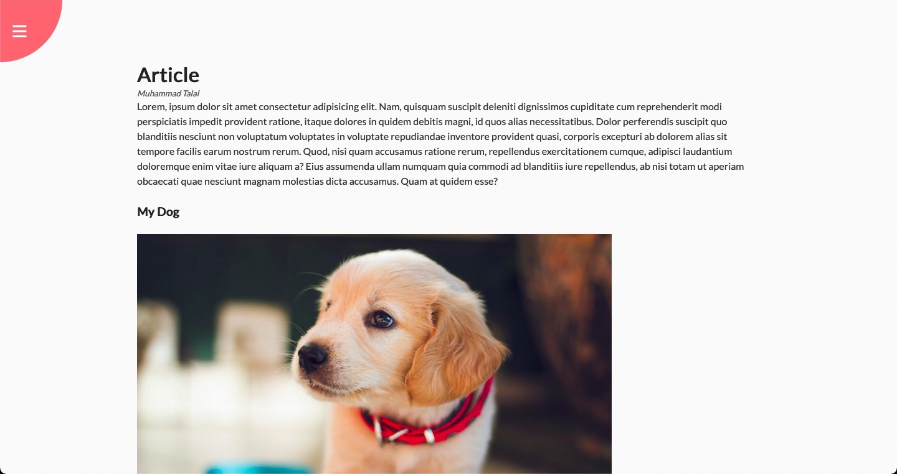
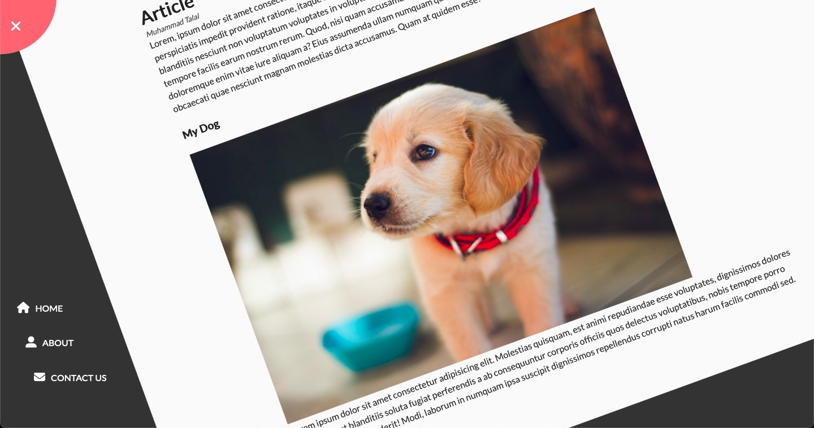

# Brad Traversy - Rotating Nav Animation

This project was taken from  [Udemy by Brad Traversy and Florin Pop](https://www.udemy.com/course/50-projects-50-days/). Sharpen your skills by building 50 quick, unique & fun mini projects

## Table of contents

- [Overview](#overview)
  - [Screenshot](#screenshot)
  - [Links](#links)
- [My process](#my-process)
  - [Built with](#built-with)
- [Author](#author)

## Overview

### Screenshot

### Links

- Live Site URL: [Rotating Nav Animation](https://zoxabbasi.github.io/rotating-nav-animation_brad-traversy/)

## My process

- Using CSS to style the page.
- Using transform, transition-delay and positions.
- Using Javascript to add a class to the container.

### Built with

- Semantic HTML5 markup
- CSS custom properties
- Javascript

## Author

- Website - [Talal Abbasi](https://zoxabbasi.github.io/)
- Twitter - [@zoxabbasi](https://www.twitter.com/zoxabbasi)
